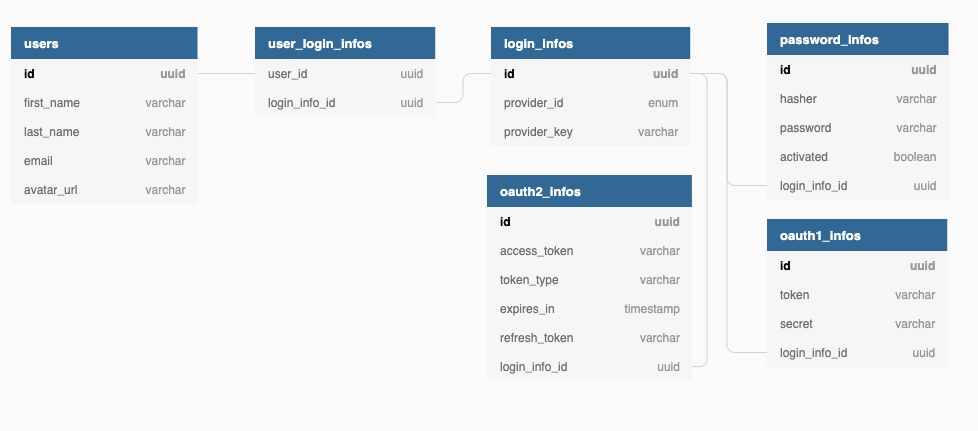

# Registration

## DB schema

## SignUp process

### SignUp using credentials

Get user email, first name, last name and password from request
Check user already exist
- Not exists
  1. Create LoginInfo(id = uuid, providerId = “credentials”, providerKey = userEmail)
  2. Hash password
  3. Create PasswordInfo(hasher = “md5(sha())”, password = “hashedPassword”, loginInfoId = LoginInfo.id)
  4. Create user with field `activated` = false
  5. Send email with link for user activation (just println link in console as test implementation) (for simplify could be something like /activate/{userId})
 
- Exist but not activated
  1. UserExistsButNotActivated error
  2. Send email for activate account 

- Exists
  1. UserAlreadyExists error
  2. Redirect to login page  

### Activate user
- user goes by link
- update field `activated` = true
- redirect to login page

### SignIn using credentials
- Get email and password from request
- select LoginInfo from db by 'providerId = “credentials” and providerKey = userEmail`
  - login info exists:
    - select `password_info` by `login_info_id`
    - hash password from request using hasher from `password_infos` table
    - compare hashed password from request with password from DB
      - hashed passwords are equal:
        - authenticate user
      - hashed passwords are not equal:
        - return IncorrectSignature error
        - +++ could be added `max login attempts` logic 
  - login info doesn't exist:
    - return UserDoesNotExist error
    - redirect to SignUp page

### WIP: SignIn/SignUp using OAuth1/OAuth2 protocols
- Make request to provider (facebook/google/twitter/etc) for authenticate
- create LoginInfo(providerId = ‘google’, providerKey = ‘googleUserId’)
- loginInfo already exists:
  - exists: authenticate user
  - not exist: insert login info and authenticate user

#### Available providers 
##### OAuth1
- LinkedIn
- Twitter
##### OAuth2
- Auth0 
- Dropbox
- Facebook
- GitHub (https://developer.github.com/apps/building-oauth-apps/authorizing-oauth-apps/)
- Gitlab
- Google (https://developers.google.com/identity/sign-in/web/server-side-flow)
- Instagram
- LinkedIn

#### Resources
- https://auth0.com/docs/videos/learn-identity
- https://developer.github.com/apps/building-oauth-apps/authorizing-oauth-apps/

### Additional functionality that could be added (will be described if needed)
#### Change password
#### Reset password
#### Link new LoginInfo to existing account
